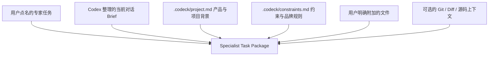

# Codeck

**Keep building in Codex. Call the right model only when you need it.**

Codeck 让你留在 Codex 里，按需调用 Gemini、Claude、Kimi 等模型最擅长的能力，并把结果交回 Codex，继续完成产品。

Codex 始终是主工作台和主持人。只有当你明确点名外部模型时，Codeck 才会为这次任务准备恰当的项目背景并调用它；不用切换工作台，不用重新解释产品，也不替你擅自选择模型。

---

[简体中文](./README.md) | [English](./README_EN.md)

---

[](https://opensource.org/licenses/MIT)
[](https://nodejs.org/)
[](https://modelcontextprotocol.org)
[](https://skills.sh/isdou/codeck)


## ⚡ 安装 Agent Skill

```bash
npx skills add https://github.com/isdou/codeck --skill codeck
```

> 单独安装 Skill 只会添加“何时以及怎样调用 Codeck”的指令，不会注册 MCP 运行时。推荐安装下方的 Codex 插件：它同时包含 Skill 和已打包的 Codeck MCP，无需 clone 仓库、`npm install`、`npm link` 或手动 `codeck init`。

## 🎯 为什么需要 Codeck？

当你把 Codex 作为完整产品开发的主工作台时，可能仍会对不同模型有明确偏好：

1. 开发和最终决策留在 **Codex**；
2. 产品文案、营销表达或视觉语言想交给 **Gemini**；
3. 架构复核想听 **Claude**，长文档和大上下文任务想交给 **Kimi**；
4. 完成局部专家任务后，继续回到 Codex 判断、修改和落地。

真正的麻烦不是缺少另一个聊天窗口，而是：**一旦离开 Codex，就要重新解释产品定位、目标用户、当前进度、已经做出的决策和这次任务的约束。**

**Codeck 就是为了解决这个问题而生的。**  
它是 **Codex-first 的外部模型技能调用层**：Codex 是 Host，Gemini、Claude、Kimi、Grok 或 Antigravity 是被临时请来的 Specialist，Codeck 负责准备这一次任务所需的最小背景，并把结果带回 Codex。

---

## ✨ 核心特性

- 🧠 **Codex 始终主持**：外部模型只完成被点名的局部专家任务，结果回到当前 Codex 对话继续判断和落地。
- 🧭 **用户明确点名**：MCP 调用必须指定 Gemini、Claude、Kimi、Grok、Antigravity 等已配置执行器；Codeck 不替用户自动选模。
- 🎯 **名称稳定解析**：Executor 名不区分大小写；`Agy` / `AGY` / `Antigravity` 统一调用 `antigravity`，而不是创建 Codex 内部 subagent。`Gemini` 默认通过 Agy 调用；只有明确说 `Gemini CLI`、`Gemini API` 或 `Gemini Image` 才走对应的独立 Executor。
- 📦 **任务型上下文包**：始终包含项目说明和约束，可附上 Codex 从当前对话整理的任务背景；文案等非代码任务无需发送 Git diff 和源码。
- 🔌 **Codex MCP 无缝集成**：在 Codex 中说 `“让 Gemini 根据当前产品背景写 App Store 文案”`，Codeck 在后台完成调用并把结果直接返回当前对话。
- 🛡️ **仓库上下文按需加入**：架构 Review 等代码任务可以显式加入 Git 状态、diff、规则和相关文件；产品文案默认只需要最小背景。
- 🗂️ **项目级交接归档**：每次经由 Codeck 发出的请求都会保存到项目内的 SQLite 归档，默认掩码明显密钥，可搜索、回放、收藏和导出。
- ⏳ **长任务自动续接**：MCP 宿主等待接近 60 秒时，Codeck 返回 `runId` 并让 Agy 等执行器继续后台运行，随后通过 `wait_run` 取回完整结果。
- 🔔 **非阻塞更新提醒**：调用完成后才提示新版本；每个 MCP 进程最多每 6 小时检查一次，1.5 秒超时且失败静默，不传送项目内容。可用 `CODECK_DISABLE_UPDATE_CHECK=1` 关闭。
- 🪄 **首次使用自动准备**：插件内置单文件 MCP 运行时；第一次在某个项目调用时自动创建缺失的 `.codeck` 配置与说明文件，并在执行前检查被点名的模型 CLI。

---

## 🚀 2 步极速上手

### 第一步：安装侧边栏插件（推荐）

如果你使用的是支持插件的 Codex，可以直接从 Codeck 的 Git marketplace 安装：

```bash
codex plugin marketplace add isdou/codeck --ref main
codex plugin add codeck@codeck
```

开发本地副本时，也可以把 marketplace 地址替换为本地路径：

```bash
codex plugin marketplace add /绝对路径/to/codeck
codex plugin add codeck@codeck
```

安装完成后重启 Codex 或新开任务，Codeck 会出现在插件侧边栏中。插件已经包含可直接启动的 Codeck MCP 运行时，唯一的基础运行前提是 PATH 中有 Node.js 20 或更高版本。它不包含外部模型；只需安装并登录你实际要调用的 provider CLI。

首次调用会在当前项目安全地补齐 `.codeck/config.toml`、`.codeck/project.md` 和 `.codeck/constraints.md`，已存在的文件不会被覆盖。若被点名的 CLI 缺失，Codeck 会在调用模型前返回具体原因和下一步；安装第三方 CLI 前仍会要求你的同意，登录、OAuth 和 API key 始终由你完成。

### 本地开发或独立 CLI（可选）

只有开发 Codeck 本身或需要全局 `codeck` 命令时，才需要克隆仓库并执行：

```bash
npm install
npm run build
npm link
```

运行健康检查，确认本地有哪些可用的 AI 命令行工具。若当前项目尚未初始化，`doctor` 会自动完成初始化：
```bash
codeck doctor
```

> 💡 **小贴士**：Codeck 可以帮你安装已内置支持的 CLI：
> ```bash
> codeck install antigravity  # 推荐：安装 Google agy CLI
> codeck install gemini       # 兼容旧版 Gemini CLI（企业/API key 用户）
> codeck install kimi          # 安装 Kimi Code CLI
> codeck install grok          # 安装 Grok Build CLI
> ```

> **Google CLI 迁移提示**：自 2026 年 6 月 18 日起，Google 不再为个人/免费账户的 Gemini CLI 请求提供服务。Codeck v0.4 将 Antigravity/Agy 作为默认 Google CLI 路径；旧的 `gemini` CLI 适配器仍保留给企业许可用户，`gemini_api` 和 `gemini_image` 仍走 Gemini API。详见 [Google 的迁移公告](https://developers.googleblog.com/an-important-update-transitioning-gemini-cli-to-antigravity-cli/)。

Codeck 会通过 Agy 的 `--model` 显式固定 `[agents.antigravity].model`，并将选定的任务包直接传给模型，避免 headless 模式额外申请文件读取权限。Agy 的只读咨询使用 plan + sandbox 模式。可用 `agy models` 查看当前可选模型，再按需修改 `model`。

> **数据边界**：Codeck 在本地组装本次任务、项目说明、约束、Codex 提供的 brief，以及用户明确选择的文件；Git、diff 和源码只在需要仓库上下文时加入。当你明确点名外部执行器后，这个任务包会通过该执行器自己的 CLI/服务发送给对应模型提供方。Codeck 的项目归档默认保存在本地，并掩码明显密钥。

### 项目说明（首次调用自动生成）

你不再需要把 `codeck init` 当作前置步骤。若希望在第一次调用前先填写项目背景，也可以在项目目录主动执行：
```bash
codeck init
```
这会在当前项目下创建 `.codeck/` 目录，里面包含：
- `config.toml`：路由规则、Executor（执行器）权限、上下文预算设置。
- `project.md`：填写产品定位、目标用户、核心差异和技术实现，让被点名的模型不用重新认识项目。
- `constraints.md`：填写品牌语气、禁用表达、输出限制，以及开发规范与避坑指南。

### 第二步：在 Codex 中点名你的第一个 Specialist

完成下方 MCP 配置后，直接在 Codex 中说：

> “让 Gemini 根据当前产品背景，生成 App Store 副标题、简介和完整描述。”

Codex 会整理这次任务需要的背景，Codeck 调用你点名的 Gemini 执行器，并把结果带回当前对话。终端模式仍可作为 fallback：

```bash
codeck ask gemini_api "根据 .codeck/project.md 的产品信息写一版 App Store 文案"
codeck ask kimi "梳理这个项目的模块边界"
codeck ask grok "Review 当前 diff 并按风险排序"
```

---

## 🛠 常用命令指南

Codeck 的 CLI 命令设计得非常直观，适合日常开发、调试或在其他终端环境作为 Fallback 工具使用。

| 命令 | 示例 | 作用说明 |
| :--- | :--- | :--- |
| **`codeck init`** | `codeck init` | 可选地提前创建 `.codeck`；首次项目调用也会自动完成 |
| **`codeck doctor`** | `codeck doctor` | 检查本机环境中的各 AI CLI 状态与连接可行性 |
| **`codeck list`** | `codeck list` | 查看当前项目下可用的 Executor 列表和它们的权限 |
| **`codeck context`** | `codeck context` | 手动刷新并生成当前项目的上下文快照 `.codeck/context.md` |
| **`codeck pick`** | `codeck pick "架构重构建议"` | 预览任务，查看 Codeck 的路由算法会把该任务分配给谁 |
| **`codeck auto`** | `codeck auto "用 Agy 看这个样式问题"` | **配置路由**：按显式模型名或本地规则选择 Executor 运行 |
| **`codeck ask`** | `codeck ask antigravity "测试这部分逻辑"` | **只读提问**：发送任务给指定 Executor，默认控制在较小上下文，防止超时卡顿 |
| **`codeck delegate`**| `codeck delegate codex_implementer "编写测试用例" -y` | **执行授权**：允许 Executor 回写代码或执行 Shell（配合 `-y` 自动确认危险操作） |
| **`codeck compare`** | `codeck compare claude_architect,gemini_frontend "架构重构方案"` | **对比模式**：让多个 AI 工具针对同一上下文各做一次回答（`gemini_frontend` 保留为兼容名称，默认由 Agy 执行） |
| **`codeck last`** | `codeck last` | 打印上一次 Codeck 运行的 AI 完整回答 |
| **`codeck bringback`**| `codeck bringback` | 把上一步的外部 AI 回答格式化为 Hand-off 信息，供 Codex 读回 |
| **`codeck runs`** | `codeck runs [query]` | 查询当前项目的 Codeck 归档 |
| **`codeck run`** | `codeck run <run-id> --content` | 查看一次归档记录及其掩码后的请求内容 |
| **`codeck wait`** | `codeck wait <run-id>` | 等待长任务完成并取回结果 |
| **`codeck curate`** | `codeck curate <run-id> --tag architecture` | 把一次交接标记为可复用知识 |
| **`codeck delete-run`** | `codeck delete-run <run-id> --yes` | 显式确认后删除一条归档 |
| **`codeck replay`** | `codeck replay <run-id>` | 使用历史快照重新调用一次模型 |
| **`codeck export`** | `codeck export -f markdown` | 导出项目归档 |

---

## 🧠 核心工作原理

### 1. 专家任务包是怎样组装的？
Codeck 以本次任务为中心组装 Markdown 背景，并自动控制大小。项目说明和约束始终可用；Codex 可以附上从当前对话整理的 brief；Git 和源码只在代码任务中显式加入：



### 2. 预算控制 (Budget)
有些 CLI 工具如果一次喂太多上下文会非常慢。因此，Codeck 在 `config.toml` 里内置了两个阶段的预算限制：
- **`ask_context_chars`** (默认 `16,000` 字符)：适用于只读式的小提问，保证速度。
- **`max_context_chars`** (默认 `60,000` 字符)：适用于 `delegate`（具体实现）或使用 `--full-context` 参数时的完整回答。

每次运行后，CLI 会打印本次上下文占用、prompt/completion token 和成本估算；运行摘要也会写入 `.codeck/runs/*.json` 与 `.codeck/runs/*.md`。API executor 会尽量使用 provider 返回的真实 token；普通 CLI executor 拿不到真实账单时会按字符数估算，并标记为 `Est.`。

经由 Codeck 发出的请求、实际调用提示、上下文快照、增量输出和最终结果会进入 `.codeck/archive.sqlite3`；默认掩码明显密钥，超长内容会外置到 `.codeck/archive/payloads/`。`.codeck/runs/` 仅保留兼容旧版本的轻量记录。MCP 可使用 `wait_run`、`list_runs`、`search_runs`、`curate_run`、`replay_run` 和 `export_archive` 管理这些记录。

---

## ⚙️ 路由规则与配置

初始化后，你可以在 `.codeck/config.toml` 中精细化定制你的路由策略。

### 1. CLI fallback 的自定义路由关键字

Codex/MCP 的主流程要求用户明确指定执行器。下面的 `[routing]` 规则只用于 `codeck pick` 和 `codeck auto` 等终端 fallback：

```toml
[routing]
default_executor = "antigravity"

[[routing.rules]]
name = "frontend"
executor = "gemini_frontend"
keywords = ["frontend", "ui", "css", "html", "样式", "界面", "页面"]

[[routing.rules]]
name = "architecture"
executor = "claude_architect"
keywords = ["architecture", "review", "risk", "架构", "评审", "重构"]
```

### 2. 认识内置的 Executor 角色
Codeck 预设了以下 Executor 配置文件：
- ✨ **`gemini`**：通用 Gemini Specialist，默认使用维护中的 Antigravity/Agy 路径。
- 💾 **`gemini_cli`**：仅用于企业许可或 API-key 用户的旧 Gemini CLI。
- 🧑‍🎨 **`gemini_frontend`**：历史兼容名称，默认通过 Antigravity/Agy 做前端 UI 优化与大上下文分析。
- 🏗 **`claude_architect`**：调用 Claude，最适合做深度的架构分析和重构 Review。
- 🌙 **`kimi`**：调用 Kimi Code CLI，用于仓库探索和长上下文分析。
- 🚀 **`grok`**：调用 Grok Build CLI，默认带 `read-only` sandbox 进行 Review 和分析。
- 💻 **`codex_implementer`**：允许写文件和跑 Shell，通常用于将分析好的方案带回 Codex 进行落地编码。

Kimi 官方的 `-p` 模式目前没有与 Grok `--sandbox read-only` 等价的硬隔离参数，因此 Codeck 内置的 `kimi` 是“策略只读”，不应当作 OS 级文件系统沙箱。

### 3. 接入其他 CLI

只要一个 CLI 支持无交互输入和 stdout 输出，就可以通过 `generic` adapter 接入，无需修改 Codeck 的路由层：

```toml
[agents.qwen]
command = "qwen"
adapter = "generic"
prompt_args = ["-p", "{prompt}"]
timeout_ms = 180000

[executors.qwen]
agent = "qwen"
role = "code_analyst"
description = "Qwen CLI read-only analysis"
allowed_modes = ["ask", "subagent", "compare"]
read_files = true
write_files = false
run_shell = false
context_include = ["README.md", "src/**", "current_diff"]
```

`{prompt}` 会被替换为 Codeck 打包的完整上下文。如果 CLI 从 stdin 读 prompt，设置 `prompt_args = []`。对通用 CLI，`write_files` / `run_shell` 是 Codeck 的权限声明；还需要在 `prompt_args` 中配置该 CLI 自身的 sandbox / permission 参数，才能形成硬约束。

### 4. 配置 API Key 与直连 API 模式
如果你想为 CLI 注入自定义 API Key，或者不想在本地安装重度 CLI 工具，直接利用 API 秘钥调用大模型，可以使用以下两种方式：

#### 方式 A：自动加载 `.env` / 配置环境变量
在你的项目根目录或 `.codeck/` 目录下创建一个 `.env` 文件（建议将 `.env` 添加至你的 `.gitignore` 中）：
```env
GEMINI_API_KEY=你的谷歌GeminiAPI秘钥
ANTHROPIC_API_KEY=你的AnthropicClaudeAPI秘钥
```
Codeck 会自动读取该文件。内置 CLI 只传递它需要的 provider 凭据；其他自定义变量请在 `.codeck/config.toml` 里为指定 agent 配置 `env` 字段：
```toml
[agents.claude]
command = "claude"
[agents.claude.env]
ANTHROPIC_API_KEY = "你的SK秘钥"
```

#### 方式 B：使用直连 API Executor（无需安装 CLI）
本工具内置了 `gemini_api` 与 `claude_api` 两个直连适配器，利用 Node 原生 `fetch` 发送请求。你只需要在配置或 `.env` 中提供 API 秘钥，即可直接向大模型发起 `ask`：
```bash
# 直接调接口向 Gemini 提问，无需安装 @google/gemini-cli
codeck ask gemini_api "Explain recursion in 1 sentence"

# 直接调接口向 Claude 提问，无需安装 claude-code
codeck ask claude_api "Explain recursion in 1 sentence"
```
你还可以在 `.codeck/config.toml` 中自定义模型：
```toml
[agents.gemini_api]
api_key = "AIzaSy..."
model = "gemini-2.5-pro" # 默认是 gemini-2.5-flash
```

---

## 🔌 接入 Codex MCP (推荐玩法)

把 Codeck 配置进 Codex 之后，你甚至不需要手动打开终端输入 `codeck` 命令。

### 1. 添加 MCP 服务
使用绝对路径（将下面的 `/Users/yourname/codeck` 换成你本机的实际安装路径）向 Codex 注册 MCP：
```bash
codex mcp add codeck -- node /Users/yourname/codeck/dist/codeck.bundle.js mcp start
```

### 2. 在 Codex 里自然对话
配置完成后，只要你在与 Codex 对话时**明确点名了已配置的外部执行器**，Codex 就会把这次局部专家任务交给 Codeck。Codeck 不会因为任务复杂就自行选择外部模型。

**例如，你可以对 Codex 说：**
> *“让 Gemini 根据我们刚才定下的定位，写一版 App Store 文案。”*
>
> *“用 Claude 复核一下当前架构方案，只需要给建议，不要修改代码。”*

Codex 会把本次任务、必要的产品背景和用户明确选择的项目材料交给 Codeck。外部模型的结果随后直接回到当前对话，由 Codex 继续主持、修改、采用或否决。

---

## 🤝 参与贡献

如果你在使用中发现了 Bug，或者希望适配更多本地 AI CLI 工具（如 DeepSeek CLI 等），非常欢迎提交 Issue 或 Pull Request！

1. Fork 本仓库
2. 创建你的特性分支 (`git checkout -b feature/amazing-feature`)
3. 提交你的改动 (`git commit -m 'Add some amazing feature'`)
4. 推送到分支 (`git push origin feature/amazing-feature`)
5. 新建 Pull Request

---

## 📄 许可证

本项目基于 [MIT](LICENSE) 许可证开源。
