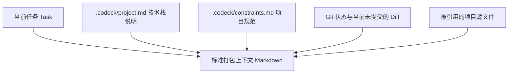

# Codeck

**Codex 优先的本地上下文交接器：把一个仓库的上下文交给其他 AI 编程 CLI。**

Codeck 会把当前仓库的 Git 状态、diff、AGENTS 规则、项目说明和相关文件组装成有边界的上下文，再交给你明确指定的 Claude Code、Gemini CLI、Kimi、Grok 或 Antigravity。结果保存在项目本地，便于搜索、回放和交接。

---

[简体中文](./README.md) | [English](./README_EN.md) | [贡献指南](./CONTRIBUTING.md)

---

[](https://opensource.org/licenses/MIT)
[](https://nodejs.org/)
[](https://modelcontextprotocol.org)
[](https://skills.sh/isdou/codeck)


## ⚡ 安装 Agent Skill

```bash
npx skills add https://github.com/isdou/codeck --skill codeck
```

> 这个 Skill 通过本地 Codeck CLI 执行模型协作。首次使用前还需要按下方“5 分钟跑通”完成 CLI 安装与 `codeck doctor` 检查。

## 🎯 Codeck 解决什么问题？

切换 AI 编程 CLI 时，最浪费时间的通常不是调用模型，而是重新解释项目：技术栈、当前 diff、团队规则和已经讨论过的上下文都要再复制一遍。

Codeck 把这段交接固定成一个本地、可检查的流程：只有你明确点名外部执行器时才路由；上下文受预算和权限控制；结果默认保存在本地并掩码明显密钥。

---

## ✨ 核心特性

- 📦 **零配置上下文打包**：自动提取 Git 状态、Current Diff、项目背景、全局约束规则、相关源文件，融合成标准上下文。
- 🧭 **显式模型触发**：只有任务里明确提到 Gemini、Claude、Kimi、Grok、Antigravity 等执行器时，才交给对应工具。
- 🔎 **可预览路由 (`pick`)**：不确定会交给谁时，先预览，不直接执行。
- 📊 **多模型同台竞技 (`compare`)**：输入一条任务，让 Claude 和 Gemini 针对同一上下文分别给出方案，方便对比。
- 🤖 **脚本友好输出 (`--json`)**：路由结果可以稳定输出为 JSON，方便接入脚本、CI 和其他开发工具。
- 🔌 **Codex MCP 无缝集成**：一次性把 Codeck 注册为 Codex 的 MCP 服务，以后你在 Codex 聊天时输入 `“用 Agy 帮我分析当前实现”`，Codex 就会在后台自动调用 Codeck，不需要手动切出命令行！
- 🗂️ **项目级交接归档**：每次经由 Codeck 发出的请求都会保存到项目内的 SQLite 归档，默认掩码明显密钥，可搜索、回放、收藏和导出。
- ⏳ **长任务自动续接**：MCP 宿主等待接近 60 秒时，Codeck 返回 `runId` 并让 Agy 等执行器继续后台运行，随后通过 `wait_run` 取回完整结果。

---

## 🚀 5 分钟跑通

### 1. 安装 Codeck

Codeck 的命令始终叫 `codeck`。npm 包使用 scoped 名称，避免和 npm 上已经存在的无关同名包冲突：

```bash
# 从 GitHub 安装（当前可用）
npm install -g git+https://github.com/isdou/codeck.git

# npm 包发布后，也可以使用官方入口
npm install -g @isdou/codeck

codeck --version
```

### 2. 初始化并完成自检

在你要开发的项目根目录执行：

```bash
codeck init
codeck doctor
codeck ask mock "确认 Codeck 已安装"
```

内置的 `mock` 执行器不需要模型账号，可以先验证 Codeck 本身可用。`codeck init` 会创建 `.codeck/`，其中包含路由配置、项目说明和约束文件。

### 3. 连接外部执行器

例如使用 Google Antigravity/Agy：

```bash
codeck install antigravity
codeck pick "用 Agy 分析当前 diff 有没有明显问题"
codeck auto "用 Agy 分析当前 diff 有没有明显问题"
```

脚本或 CI 需要机器可读结果时，给路由命令加 `--json`：

```bash
codeck auto --json "用 Agy 分析当前 diff"
```

如果你使用支持插件的 Codex，可以从 Codeck 的 Git marketplace 安装侧边栏插件：

```bash
codex plugin marketplace add isdou/codeck --ref main
codex plugin add codeck@codeck
```

插件不包含外部模型；你仍需要在本机安装并登录要调用的 CLI。Codeck 会为 Agy 显式固定 `[agents.antigravity].model` 对应的 agent，并把较长的路由上下文暂存到 `.codeck/context.md`。

> **数据边界**：Codeck 在本地收集和组装 Git 状态、diff、项目说明及规则；当你明确点名外部执行器后，选定的上下文会通过该执行器自己的 CLI/服务发送给对应模型提供方。请在发送前检查项目内容和提供方政策。项目归档默认保存在本地，并掩码明显密钥。

---

## 🛠 常用命令指南

Codeck 的 CLI 命令设计得非常直观，适合日常开发、调试或在其他终端环境作为 Fallback 工具使用。

| 命令 | 示例 | 作用说明 |
| :--- | :--- | :--- |
| **`codeck init`** | `codeck init` | 在当前目录下初始化 `.codeck` 配置与上下文描述文件 |
| **`codeck doctor`** | `codeck doctor` | 检查本机环境中的各 AI CLI 状态与连接可行性 |
| **`codeck list`** | `codeck list` | 查看当前项目下可用的 Executor 列表和它们的权限 |
| **`codeck context`** | `codeck context` | 手动刷新并生成当前项目的上下文快照 `.codeck/context.md` |
| **`codeck pick`** | `codeck pick "架构重构建议"` | 预览任务，查看 Codeck 的路由算法会把该任务分配给谁 |
| **`codeck auto`** | `codeck auto "用 Agy 看这个样式问题"` | **配置路由**：按显式模型名或本地规则选择 Executor 运行 |
| **`codeck ask`** | `codeck ask antigravity "测试这部分逻辑"` | **只读提问**：发送任务给指定 Executor，默认控制在较小上下文，防止超时卡顿 |
| **`codeck delegate`**| `codeck delegate codex_implementer "编写测试用例" -y` | **执行授权**：允许 Executor 回写代码或执行 Shell（配合 `-y` 自动确认危险操作） |
| **`codeck compare`** | `codeck compare claude_architect,gemini_frontend "架构重构方案"` | **对比模式**：让多个 AI 工具针对同一上下文各做一次回答（`gemini_frontend` 保留为兼容名称，默认由 Agy 执行） |
| **`codeck last`** | `codeck last` | 打印上一次 Codeck 运行的 AI 完整回答 |
| **`codeck bringback`**| `codeck bringback` | 把上一步的外部 AI 回答格式化为 Hand-off 信息，供 Codex 读回 |
| **`codeck runs`** | `codeck runs [query]` | 查询当前项目的 Codeck 归档 |
| **`codeck run`** | `codeck run <run-id> --content` | 查看一次归档记录及其掩码后的请求内容 |
| **`codeck wait`** | `codeck wait <run-id>` | 等待长任务完成并取回结果 |
| **`codeck curate`** | `codeck curate <run-id> --tag architecture` | 把一次交接标记为可复用知识 |
| **`codeck delete-run`** | `codeck delete-run <run-id> --yes` | 显式确认后删除一条归档 |
| **`codeck replay`** | `codeck replay <run-id>` | 使用历史快照重新调用一次模型 |
| **`codeck export`** | `codeck export -f markdown` | 导出项目归档 |

`auto`、`route`、`ask`、`delegate` 和 `compare` 都支持 `--json`，便于脚本和 CI 读取稳定的 JSON 结果。

---

## 🧠 核心工作原理

### 1. 上下文是怎样组装的？
当你在项目下调用 Codeck 时，它会根据以下规则组装一份 Markdown 上下文，并自动控制大小以防撑爆 AI 窗口：



### 2. 预算控制 (Budget)
有些 CLI 工具如果一次喂太多上下文会非常慢。因此，Codeck 在 `config.toml` 里内置了两个阶段的预算限制：
- **`ask_context_chars`** (默认 `16,000` 字符)：适用于只读式的小提问，保证速度。
- **`max_context_chars`** (默认 `60,000` 字符)：适用于 `delegate`（具体实现）或使用 `--full-context` 参数时的完整回答。

每次运行后，CLI 会打印本次上下文占用、prompt/completion token 和成本估算；运行摘要也会写入 `.codeck/runs/*.json` 与 `.codeck/runs/*.md`。API executor 会尽量使用 provider 返回的真实 token；普通 CLI executor 拿不到真实账单时会按字符数估算，并标记为 `Est.`。

经由 Codeck 发出的请求、实际调用提示、上下文快照、增量输出和最终结果会进入 `.codeck/archive.sqlite3`；默认掩码明显密钥，超长内容会外置到 `.codeck/archive/payloads/`。`.codeck/runs/` 仅保留兼容旧版本的轻量记录。MCP 可使用 `wait_run`、`list_runs`、`search_runs`、`curate_run`、`replay_run` 和 `export_archive` 管理这些记录。

---

## ⚙️ 路由规则与配置

初始化后，你可以在 `.codeck/config.toml` 中精细化定制你的路由策略。

### 1. 自定义路由关键字
你可以修改 `[routing]` 部分的规则，当任务中出现特定词汇时自动派发给相应的 AI：

```toml
[routing]
default_executor = "antigravity"

[[routing.rules]]
name = "frontend"
executor = "gemini_frontend"
keywords = ["frontend", "ui", "css", "html", "样式", "界面", "页面"]

[[routing.rules]]
name = "architecture"
executor = "claude_architect"
keywords = ["architecture", "review", "risk", "架构", "评审", "重构"]
```

### 2. 认识内置的 Executor 角色
Codeck 预设了以下 Executor 配置文件：
- 🧑‍🎨 **`gemini_frontend`**：历史兼容名称，默认通过 Antigravity/Agy 做前端 UI 优化与大上下文分析。
- 🏗 **`claude_architect`**：调用 Claude，最适合做深度的架构分析和重构 Review。
- 🌙 **`kimi`**：调用 Kimi Code CLI，用于仓库探索和长上下文分析。
- 🚀 **`grok`**：调用 Grok Build CLI，默认带 `read-only` sandbox 进行 Review 和分析。
- 💻 **`codex_implementer`**：允许写文件和跑 Shell，通常用于将分析好的方案带回 Codex 进行落地编码。

Kimi 官方的 `-p` 模式目前没有与 Grok `--sandbox read-only` 等价的硬隔离参数，因此 Codeck 内置的 `kimi` 是“策略只读”，不应当作 OS 级文件系统沙箱。

### 3. 接入其他 CLI

只要一个 CLI 支持无交互输入和 stdout 输出，就可以通过 `generic` adapter 接入，无需修改 Codeck 的路由层：

```toml
[agents.qwen]
command = "qwen"
adapter = "generic"
prompt_args = ["-p", "{prompt}"]
timeout_ms = 180000

[executors.qwen]
agent = "qwen"
role = "code_analyst"
description = "Qwen CLI read-only analysis"
allowed_modes = ["ask", "subagent", "compare"]
read_files = true
write_files = false
run_shell = false
context_include = ["README.md", "src/**", "current_diff"]
```

`{prompt}` 会被替换为 Codeck 打包的完整上下文。如果 CLI 从 stdin 读 prompt，设置 `prompt_args = []`。对通用 CLI，`write_files` / `run_shell` 是 Codeck 的权限声明；还需要在 `prompt_args` 中配置该 CLI 自身的 sandbox / permission 参数，才能形成硬约束。

### 4. 配置 API Key 与直连 API 模式
如果你想为 CLI 注入自定义 API Key，或者不想在本地安装重度 CLI 工具，直接利用 API 秘钥调用大模型，可以使用以下两种方式：

#### 方式 A：自动加载 `.env` / 配置环境变量
在你的项目根目录或 `.codeck/` 目录下创建一个 `.env` 文件（建议将 `.env` 添加至你的 `.gitignore` 中）：
```env
GEMINI_API_KEY=你的谷歌GeminiAPI秘钥
ANTHROPIC_API_KEY=你的AnthropicClaudeAPI秘钥
```
Codeck 运行任何指令时会自动读取该文件，并在调用本地 CLI 时自动注入环境变量。你也可以在 `.codeck/config.toml` 里为指定 agent 配置 `env` 字段：
```toml
[agents.claude]
command = "claude"
[agents.claude.env]
ANTHROPIC_API_KEY = "你的SK秘钥"
```

#### 方式 B：使用直连 API Executor（无需安装 CLI）
本工具内置了 `gemini_api` 与 `claude_api` 两个直连适配器，利用 Node 原生 `fetch` 发送请求。你只需要在配置或 `.env` 中提供 API 秘钥，即可直接向大模型发起 `ask`：
```bash
# 直接调接口向 Gemini 提问，无需安装 @google/gemini-cli
codeck ask gemini_api "Explain recursion in 1 sentence"

# 直接调接口向 Claude 提问，无需安装 claude-code
codeck ask claude_api "Explain recursion in 1 sentence"
```
你还可以在 `.codeck/config.toml` 中自定义模型：
```toml
[agents.gemini_api]
api_key = "AIzaSy..."
model = "gemini-2.5-pro" # 默认是 gemini-2.5-flash
```

---

## 🔌 接入 Codex MCP (推荐玩法)

把 Codeck 配置进 Codex 之后，你甚至不需要手动打开终端输入 `codeck` 命令。

### 1. 添加 MCP 服务
使用绝对路径（将下面的 `/Users/yourname/codeck` 换成你本机的实际安装路径）向 Codex 注册 MCP：
```bash
codex mcp add codeck -- node /Users/yourname/codeck/dist/index.js mcp start
```

### 2. 在 Codex 里自然对话
配置完成后，只要你在与 Codex 对话时**提到了已配置外部执行器的名字**，Codex 就会把任务 delegate 给 Codeck。

**例如，你可以对 Codex 说：**
> *“帮我 review 一下刚才的改动，用 Agy 分析一下这里有没有潜在的性能瓶颈。”*
>
> *“让 Kimi 和 Grok 对比一下当前架构的主要风险。”*

Codex 将在后台调用 Codeck 唤起本地 Agy，并在对话流中直接呈现 Google 模型给出的专业分析，整个过程上下文丝滑衔接！

---

## 🤝 参与贡献

如果你在使用中发现了 Bug，或者希望适配更多本地 AI CLI 工具（如 DeepSeek CLI 等），非常欢迎提交 Issue 或 Pull Request！

1. Fork 本仓库
2. 创建你的特性分支 (`git checkout -b feature/amazing-feature`)
3. 提交你的改动 (`git commit -m 'Add some amazing feature'`)
4. 推送到分支 (`git push origin feature/amazing-feature`)
5. 新建 Pull Request

---

## 📄 许可证

本项目基于 [MIT](LICENSE) 许可证开源。
