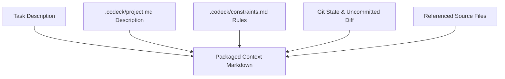

# Codeck

**Codex-first local context handoff: pass one repository's context to another AI coding CLI.**

Codeck packages the current repository's Git state, diff, AGENTS rules, project notes, and relevant files into a bounded context, then sends it to the Claude Code, Gemini CLI, Kimi, Grok, or Antigravity executor you explicitly choose. Results stay in the project-local archive for search, replay, and handoff.

---

[简体中文](./README.md) | [English](./README_EN.md) | [Contributing](./CONTRIBUTING.md)

---

[](https://opensource.org/licenses/MIT)
[](https://nodejs.org/)
[](https://modelcontextprotocol.org)
[](https://skills.sh/isdou/codeck)


## ⚡ Install the Agent Skill

```bash
npx skills add https://github.com/isdou/codeck --skill codeck
```

> This skill routes model collaboration through the local Codeck CLI. Before first use, complete the CLI setup and run `codeck doctor` in the 5-minute quick start below.

## 🎯 What problem does Codeck solve?

When switching AI coding CLIs, the costly part is often not invoking the model—it is repeating the project explanation: the stack, current diff, team rules, and context already discussed.

Codeck turns that handoff into a local, inspectable workflow: it routes only when you explicitly name an external executor, applies context and permission limits, and stores results locally with obvious secrets masked by default.

---

## ✨ Key Features

- 📦 **Zero-Config Context Packaging**: Automatically aggregates your Git state, uncommitted diffs, project background description, global constraints, and relevant files into a structured markdown context.
- 🧭 **Explicit Model Triggering**: Delegates only when the task names Gemini, Claude, Kimi, Grok, Antigravity, or another configured executor.
- 🔎 **Route Preview (`pick`)**: Preview which executor would run before handing off.
- 📊 **Multi-Model Compare (`compare`)**: Send a single task to multiple executors (e.g., Claude and Gemini) and compare their solutions side-by-side.
- 🤖 **Script-Friendly Output (`--json`)**: Emit stable JSON run results for scripts, CI, and other developer tools.
- 🔌 **Codex MCP Integration**: Add Codeck as an MCP server in Codex. You can query models directly from Codex (e.g. *"Ask Agy to analyze this performance bottleneck"*), and Codex will run Codeck behind the scenes.
- 🗂️ **Project-Local Run Archive**: Every request sent through Codeck is stored in a project-local SQLite archive with obvious secrets masked by default. Runs can be searched, replayed, curated, and exported.
- ⏳ **Resumable Long Runs**: When an MCP host is approaching its one-minute request limit, Codeck returns a `runId` while Agy or another executor continues in the background. Poll `wait_run` for the terminal result.
- 📈 **Quota & Cost Tracking**: Displays precise token usage (Prompt/Completion) and estimated USD costs at the end of each run, saving metrics to history logs.

---

## 🚀 5-Minute Quick Start

### 1. Install Codeck

The command is always `codeck`. The npm package uses a scoped name to avoid an unrelated package already occupying the unscoped name:

```bash
# Install from GitHub (available now)
npm install -g git+https://github.com/isdou/codeck.git

# Use the official npm entry after it is published
npm install -g @isdou/codeck

codeck --version
```

### 2. Initialize and verify

Run these commands from the root of the project you want to work on:

```bash
codeck init
codeck doctor
codeck ask mock "Verify that Codeck is installed"
```

The built-in `mock` executor needs no model account, so it verifies Codeck itself before you configure an external CLI. `codeck init` creates `.codeck/` with routing configuration, project notes, and constraints.

### 3. Connect an external executor

For example, install Google Antigravity/Agy and run a routed task:

```bash
codeck install antigravity
codeck pick "Ask Agy to review the current diff for obvious issues"
codeck auto "Ask Agy to review the current diff for obvious issues"
```

Use `--json` on routing commands when a script or CI job needs machine-readable output:

```bash
codeck auto --json "Ask Agy to review the current diff"
```

If your Codex build supports plugins, install the Codeck sidebar plugin from its Git marketplace:

```bash
codex plugin marketplace add isdou/codeck --ref main
codex plugin add codeck@codeck
```

The plugin does not bundle external models; install and authenticate the CLI you want to call on your own machine. Codeck pins Agy to `[agents.antigravity].model` and stages long routed context in `.codeck/context.md`.

> **Data boundary:** Codeck collects and assembles Git status, diffs, project notes, and rules locally. When you explicitly name an external executor, the selected context is sent through that executor's own CLI/service to its model provider. Review the project content and provider policy before sending. The project archive stays local by default and masks obvious secrets.

---

## 🛠 Commands Guide

| Command | Example | Description |
| :--- | :--- | :--- |
| **`codeck init`** | `codeck init` | Initializes `.codeck` configuration and description files. |
| **`codeck doctor`** | `codeck doctor` | Diagnoses the connectivity and setup status of local AI CLIs. |
| **`codeck list`** | `codeck list` | Lists all configured executor profiles and their permissions. |
| **`codeck context`** | `codeck context` | Rebuilds and updates the local context snapshot `.codeck/context.md`. |
| **`codeck pick`** | `codeck pick "Architecture refactoring"` | Previews which executor would be chosen for a task based on routing rules. |
| **`codeck auto`** | `codeck auto "Ask Agy to inspect this CSS issue"` | **Configured Routing**: Uses explicit model names or local rules to choose an executor. |
| **`codeck ask`** | `codeck ask antigravity "Write tests"` | **Read-Only**: Sends a task to a specific executor under a smaller token budget. |
| **`codeck delegate`**| `codeck delegate codex_implementer "Fix bugs" -y` | **Implementation**: Allows executors to write files or run commands (use `-y` to auto-approve). |
| **`codeck compare`** | `codeck compare claude_architect,gemini_frontend "Refactor scheme"` | **Comparison**: Runs the task on multiple executors and outputs side-by-side results. |
| **`codeck last`** | `codeck last` | Displays the output from the last executed task. |
| **`codeck bringback`**| `codeck bringback` | Formats the latest execution output as a host-ready handoff payload. |
| **`codeck runs`** | `codeck runs [query]` | Searches the current project's Codeck archive. |
| **`codeck run`** | `codeck run <run-id> --content` | Shows one archived run, including redacted request content. |
| **`codeck wait`** | `codeck wait <run-id>` | Waits for a long-running executor job and returns its current state. |
| **`codeck curate`** | `codeck curate <run-id> --tag architecture` | Marks a run as reusable project knowledge. |
| **`codeck delete-run`** | `codeck delete-run <run-id> --yes` | Permanently deletes one archive record after confirmation. |
| **`codeck replay`** | `codeck replay <run-id>` | Replays a run using its historical snapshot. |
| **`codeck export`** | `codeck export -f markdown` | Exports the project archive. |

`auto`, `route`, `ask`, `delegate`, and `compare` accept `--json` for stable machine-readable output in scripts and CI.

---

## 🧠 How It Works

### 1. Context Assembly
When running a task, Codeck bundles workspace components into a structured Markdown prompt while respecting context budget limits:



### 2. Budget Control
To avoid lag or timeouts, Codeck limits context lengths:
- **`ask_context_chars`** (Default `16,000` chars): Used for quick read-only inquiries (`ask` mode).
- **`max_context_chars`** (Default `60,000` chars): Used for complex writes (`delegate` mode) or when `--full-context` is passed.

---

## ⚙️ Customizing Rules & Keys

Customize your routing strategies in `.codeck/config.toml`.

### 1. Custom Keywords
Define routing keywords under `[routing]`. If a task contains matching terms, it will route to that executor:

```toml
[routing]
default_executor = "antigravity"

[[routing.rules]]
name = "frontend"
executor = "gemini_frontend"
keywords = ["frontend", "ui", "css", "html", "style", "page", "layout"]

[[routing.rules]]
name = "architecture"
executor = "claude_architect"
keywords = ["architecture", "review", "risk", "refactor", "design"]
```

### 2. Built-in Executors
- 🧑‍🎨 **`gemini_frontend`**: A legacy-compatible name that uses Antigravity/Agy for frontend layouts, screenshots, and long-context analysis by default.
- 🏗 **`claude_architect`**: Uses Claude, ideal for deep architectural refactoring and code reviews.
- 🌙 **`kimi`**: Uses Kimi Code CLI for repository exploration and long-context analysis.
- 🚀 **`grok`**: Uses Grok Build CLI with its `read-only` sandbox for review and analysis.
- 💻 **`codex_implementer`**: Allows file writes and command executions to apply fixes back into Codex.

Kimi's official `-p` mode currently has no hard-isolation flag equivalent to Grok's `--sandbox read-only`. The built-in `kimi` profile is therefore read-only by policy and should not be treated as an OS-level filesystem sandbox.

### 3. Integrating Other CLIs

Any CLI with non-interactive input and stdout output can use the `generic` adapter without changes to Codeck's routing layer:

```toml
[agents.qwen]
command = "qwen"
adapter = "generic"
prompt_args = ["-p", "{prompt}"]
timeout_ms = 180000

[executors.qwen]
agent = "qwen"
role = "code_analyst"
description = "Qwen CLI read-only analysis"
allowed_modes = ["ask", "subagent", "compare"]
read_files = true
write_files = false
run_shell = false
context_include = ["README.md", "src/**", "current_diff"]
```

`{prompt}` is replaced with Codeck's packaged context. Set `prompt_args = []` when the CLI reads its prompt from stdin. For generic CLIs, `write_files` and `run_shell` are Codeck permission declarations; add the CLI's own sandbox or permission flags to `prompt_args` when you need hard enforcement.

### 4. API Key & Direct REST API
You can configure API keys and run tasks directly without installing CLI wrappers:

#### Option A: Auto-Load `.env` / Custom Environment Variables
Create a `.env` file at your project root:
```env
GEMINI_API_KEY=your_gemini_api_key
ANTHROPIC_API_KEY=your_anthropic_api_key
```
Codeck will load these variables automatically and inject them when spawning CLIs. You can also specify them in `.codeck/config.toml`:
```toml
[agents.claude]
command = "claude"
[agents.claude.env]
ANTHROPIC_API_KEY = "your_key_here"
```

#### Option B: Direct API Executors (No CLI Needed)
Use the built-in `gemini_api` and `claude_api` adapters to query the REST APIs directly via Node's native `fetch`:
```bash
# Direct REST call to Gemini API without local CLI tools
codeck ask gemini_api "Explain recursion in 1 sentence"

# Direct REST call to Anthropic API
codeck ask claude_api "Explain recursion in 1 sentence"
```
Configure specific model overrides in `.codeck/config.toml`:
```toml
[agents.gemini_api]
api_key = "AIzaSy..."
model = "gemini-2.5-pro"  # Defaults to gemini-2.5-flash
```

---

## 🔌 Codex MCP Integration (Recommended)

Once registered as an MCP server, Codex will invoke Codeck automatically during natural chat sessions.

### 1. Register MCP Server
Run the following registration command using the absolute path to your Codeck installation:
```bash
codex mcp add codeck -- node /Users/yourname/codeck/dist/index.js mcp start
```

### 2. Conversational Context Hand-off
Whenever you mention a configured external executor, Codex will delegate the task to Codeck:
> *“Please review my recent changes using Agy to identify any potential performance bottlenecks.”*
>
> *“Ask Kimi and Grok to compare the main architectural risks in the current diff.”*

Codex will invoke Agy behind the scenes and display the final feedback seamlessly inside your chat.

---

## 🤝 Contributing

Bug reports, suggestions, and pull requests to adapt new CLI engines (such as DeepSeek CLI) are always welcome!

1. Fork this repository.
2. Create your feature branch (`git checkout -b feature/amazing-feature`).
3. Commit your changes (`git commit -m 'Add some amazing feature'`).
4. Push to the branch (`git push origin feature/amazing-feature`).
5. Open a Pull Request.

---

## 📄 License

This project is licensed under the [MIT](LICENSE) License.
