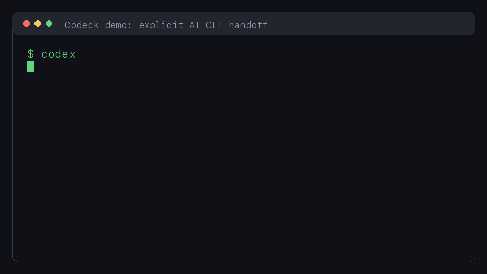
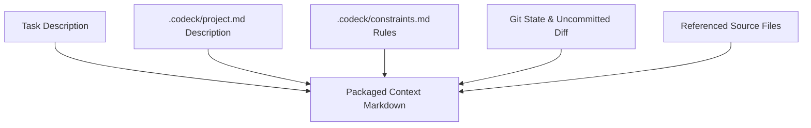

# Codeck

**Codex-first context handoff for Gemini, Claude Code, Kimi Code, Grok Build, and Antigravity CLI.**

When you explicitly ask Codex to use Gemini, Claude, Kimi, Grok, or Antigravity, Codeck packages the current repo state, diff, AGENTS rules, and project notes for that local AI CLI.
No repeated project explanation. No model choice made behind the user's back.

---

[简体中文](./README.md) | [English](./README_EN.md)

---

[](https://opensource.org/licenses/MIT)
[](https://nodejs.org/)
[](https://modelcontextprotocol.org)



## 🎯 Why Codeck?

As a developer using AI-assisted coding, you might:
1. **Love the smooth experience of Codex** for your day-to-day coding workflows;
2. But occasionally prefer **Claude Code** for complex code comprehension, architectural analysis, and reviews;
3. Or use **Gemini CLI**, **Kimi Code**, **Grok Build**, or **Antigravity CLI** for large-context analysis, UI work, and reviews.

However, switching between these CLI tools usually comes with a major pain point: **you have to copy your project context, tech stack, and current git diffs manually, and repeat your project explanation to the new AI.**

**Codeck is built to solve this exact problem.**  
Think of Codeck as a **local context handoff bridge for Codex**: it only delegates when you explicitly name the external model or executor.

---

## ✨ Key Features

- 📦 **Zero-Config Context Packaging**: Automatically aggregates your Git state, uncommitted diffs, project background description, global constraints, and relevant files into a structured markdown context.
- 🧭 **Explicit Model Triggering**: Delegates only when the task names Gemini, Claude, Kimi, Grok, Antigravity, or another configured executor.
- 🔎 **Route Preview (`pick`)**: Preview which executor would run before handing off.
- 📊 **Multi-Model Compare (`compare`)**: Send a single task to multiple executors (e.g., Claude and Gemini) and compare their solutions side-by-side.
- 🔌 **Codex MCP Integration**: Add Codeck as an MCP server in Codex. You can query models directly from Codex (e.g. *"Ask Gemini to analyze this performance bottleneck"*), and Codex will run Codeck behind the scenes.
- 📈 **Quota & Cost Tracking**: Displays precise token usage (Prompt/Completion) and estimated USD costs at the end of each run, saving metrics to history logs.

---

## 🚀 3-Step Quick Start

### Step 1: Install Codeck
Ensure you have Node.js 20 or later installed. Clone the repository and run:

```bash
npm install
npm run build
npm link
```

Check if the installation was successful and verify which local AI CLIs are configured:
```bash
codeck doctor
```

> 💡 **Tip**: Codeck can install its built-in CLI integrations for you:
> ```bash
> codeck install gemini        # Installs @google/gemini-cli
> codeck install kimi          # Installs Kimi Code CLI
> codeck install grok          # Installs Grok Build CLI
> codeck install antigravity   # Installs Google agy CLI
> ```

### Step 2: Initialize in Your Project Workspace
Navigate to your project root folder and initialize Codeck:
```bash
codeck init
```
This will create a `.codeck/` directory containing:
- `config.toml`: Routing rules, executor permissions, and token budget parameters.
- `project.md`: **Describe your project architecture & tech stack** here so the AI understands your system.
- `constraints.md`: **Specify your code styles & coding rules** here so the AI respects them.

### Step 3: Run Your First Routed Task
Preview which executor would run:
```bash
codeck pick "Ask Gemini to review the current diff for obvious issues"
```
Or target a specific executor directly:
```bash
codeck ask gemini "Identify any security vulnerabilities in the current changes"
codeck ask kimi "Map the module boundaries in this repository"
codeck ask grok "Review the current diff and rank the risks"
```

---

## 🛠 Commands Guide

| Command | Example | Description |
| :--- | :--- | :--- |
| **`codeck init`** | `codeck init` | Initializes `.codeck` configuration and description files. |
| **`codeck doctor`** | `codeck doctor` | Diagnoses the connectivity and setup status of local AI CLIs. |
| **`codeck list`** | `codeck list` | Lists all configured executor profiles and their permissions. |
| **`codeck context`** | `codeck context` | Rebuilds and updates the local context snapshot `.codeck/context.md`. |
| **`codeck pick`** | `codeck pick "Architecture refactoring"` | Previews which executor would be chosen for a task based on routing rules. |
| **`codeck auto`** | `codeck auto "Ask Gemini to inspect this CSS issue"` | **Configured Routing**: Uses explicit model names or local rules to choose an executor. |
| **`codeck ask`** | `codeck ask gemini "Write tests"` | **Read-Only**: Sends a task to a specific executor under a smaller token budget. |
| **`codeck delegate`**| `codeck delegate codex_implementer "Fix bugs" -y` | **Implementation**: Allows executors to write files or run commands (use `-y` to auto-approve). |
| **`codeck compare`** | `codeck compare claude_architect,gemini_frontend "Refactor scheme"` | **Comparison**: Runs the task on multiple executors and outputs side-by-side results. |
| **`codeck last`** | `codeck last` | Displays the output from the last executed task. |
| **`codeck bringback`**| `codeck bringback` | Formats the latest execution output as a host-ready handoff payload. |

---

## 🧠 How It Works

### 1. Context Assembly
When running a task, Codeck bundles workspace components into a structured Markdown prompt while respecting context budget limits:



### 2. Budget Control
To avoid lag or timeouts, Codeck limits context lengths:
- **`ask_context_chars`** (Default `16,000` chars): Used for quick read-only inquiries (`ask` mode).
- **`max_context_chars`** (Default `60,000` chars): Used for complex writes (`delegate` mode) or when `--full-context` is passed.

---

## ⚙️ Customizing Rules & Keys

Customize your routing strategies in `.codeck/config.toml`.

### 1. Custom Keywords
Define routing keywords under `[routing]`. If a task contains matching terms, it will route to that executor:

```toml
[routing]
default_executor = "gemini"

[[routing.rules]]
name = "frontend"
executor = "gemini_frontend"
keywords = ["frontend", "ui", "css", "html", "style", "page", "layout"]

[[routing.rules]]
name = "architecture"
executor = "claude_architect"
keywords = ["architecture", "review", "risk", "refactor", "design"]
```

### 2. Built-in Executors
- 🧑‍🎨 **`gemini_frontend`**: Uses Gemini, optimized for frontend layouts, screenshots, and long-context analysis.
- 🏗 **`claude_architect`**: Uses Claude, ideal for deep architectural refactoring and code reviews.
- 🌙 **`kimi`**: Uses Kimi Code CLI for repository exploration and long-context analysis.
- 🚀 **`grok`**: Uses Grok Build CLI with its `read-only` sandbox for review and analysis.
- 💻 **`codex_implementer`**: Allows file writes and command executions to apply fixes back into Codex.

Kimi's official `-p` mode currently has no hard-isolation flag equivalent to Grok's `--sandbox read-only`. The built-in `kimi` profile is therefore read-only by policy and should not be treated as an OS-level filesystem sandbox.

### 3. Integrating Other CLIs

Any CLI with non-interactive input and stdout output can use the `generic` adapter without changes to Codeck's routing layer:

```toml
[agents.qwen]
command = "qwen"
adapter = "generic"
prompt_args = ["-p", "{prompt}"]
timeout_ms = 180000

[executors.qwen]
agent = "qwen"
role = "code_analyst"
description = "Qwen CLI read-only analysis"
allowed_modes = ["ask", "subagent", "compare"]
read_files = true
write_files = false
run_shell = false
context_include = ["README.md", "src/**", "current_diff"]
```

`{prompt}` is replaced with Codeck's packaged context. Set `prompt_args = []` when the CLI reads its prompt from stdin. For generic CLIs, `write_files` and `run_shell` are Codeck permission declarations; add the CLI's own sandbox or permission flags to `prompt_args` when you need hard enforcement.

### 4. API Key & Direct REST API
You can configure API keys and run tasks directly without installing CLI wrappers:

#### Option A: Auto-Load `.env` / Custom Environment Variables
Create a `.env` file at your project root:
```env
GEMINI_API_KEY=your_gemini_api_key
ANTHROPIC_API_KEY=your_anthropic_api_key
```
Codeck will load these variables automatically and inject them when spawning CLIs. You can also specify them in `.codeck/config.toml`:
```toml
[agents.claude]
command = "claude"
[agents.claude.env]
ANTHROPIC_API_KEY = "your_key_here"
```

#### Option B: Direct API Executors (No CLI Needed)
Use the built-in `gemini_api` and `claude_api` adapters to query the REST APIs directly via Node's native `fetch`:
```bash
# Direct REST call to Gemini API without local CLI tools
codeck ask gemini_api "Explain recursion in 1 sentence"

# Direct REST call to Anthropic API
codeck ask claude_api "Explain recursion in 1 sentence"
```
Configure specific model overrides in `.codeck/config.toml`:
```toml
[agents.gemini_api]
api_key = "AIzaSy..."
model = "gemini-2.5-pro"  # Defaults to gemini-2.5-flash
```

---

## 🔌 Codex MCP Integration (Recommended)

Once registered as an MCP server, Codex will invoke Codeck automatically during natural chat sessions.

### 1. Register MCP Server
Run the following registration command using the absolute path to your Codeck installation:
```bash
codex mcp add codeck -- node /Users/yourname/codeck/dist/index.js mcp start
```

### 2. Conversational Context Hand-off
Whenever you mention a configured external executor, Codex will delegate the task to Codeck:
> *“Please review my recent changes using Gemini to identify any potential performance bottlenecks.”*
>
> *“Ask Kimi and Grok to compare the main architectural risks in the current diff.”*

Codex will invoke Gemini behind the scenes and display the final feedback seamlessly inside your chat.

---

## 🤝 Contributing

Bug reports, suggestions, and pull requests to adapt new CLI engines (such as DeepSeek CLI) are always welcome!

1. Fork this repository.
2. Create your feature branch (`git checkout -b feature/amazing-feature`).
3. Commit your changes (`git commit -m 'Add some amazing feature'`).
4. Push to the branch (`git push origin feature/amazing-feature`).
5. Open a Pull Request.

---

## 📄 License

This project is licensed under the [MIT](LICENSE) License.
