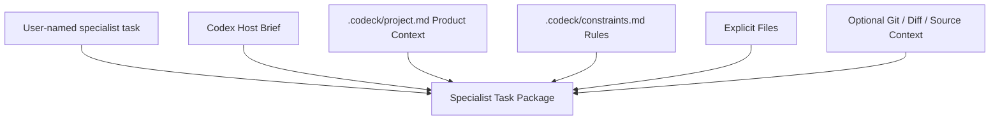

# Codeck

**Keep building in Codex. Call the right model only when you need it.**

Codeck lets you stay in Codex, call Gemini, Claude, Kimi, or another model for the work it does best, and bring the result back to Codex to keep building the product.

Codex remains the host and final decision-maker. Codeck runs an external specialist only when you explicitly name it, with a focused task package assembled from the current project and conversation. No workspace switching, no repeated product explanation, and no model choice made behind your back.

---

[简体中文](./README.md) | [English](./README_EN.md)

---

[](https://opensource.org/licenses/MIT)
[](https://nodejs.org/)
[](https://modelcontextprotocol.org)
[](https://skills.sh/isdou/codeck)


## ⚡ Install the Agent Skill

```bash
npx skills add https://github.com/isdou/codeck --skill codeck
```

> Installing only the Skill adds instructions for when and how to call Codeck; it does not register the MCP runtime. The Codex plugin below is recommended because it includes both the Skill and a bundled Codeck MCP runtime. No repository clone, `npm install`, `npm link`, or manual `codeck init` is required.

## 🎯 Why Codeck?

When Codex is your main product workspace, you may still prefer different models for specific jobs: Gemini for product copy and visual language, Claude for architecture review, or Kimi for long documents and large-context analysis.

The problem is not opening another chat window. It is having to repeat the product positioning, target user, current state, prior decisions, and task constraints every time you leave Codex.

**Codeck is built to solve this exact problem.**  
Think of Codeck as a **Codex-first external model skill layer**: Codex is the host, external models are temporary specialists, and Codeck prepares the minimum task-specific context before bringing the result back.

---

## ✨ Key Features

- 🧠 **Codex Stays in Charge**: External models complete one named specialist task; Codex reviews and applies the result.
- 📦 **Task-Focused Context**: Product notes, constraints, a compact host brief, and explicit files form the task package. Repository state and diffs are opt-in for code work.
- 🧭 **Explicit Model Triggering**: MCP calls require the executor named by the user. Codeck does not auto-select a provider.
- 🎯 **Stable Name Resolution**: Executor names are case-insensitive. `Agy`, `AGY`, and `Antigravity` all invoke `antigravity` instead of creating an internal Codex subagent. `Gemini` uses Agy by default; only explicit `Gemini CLI`, `Gemini API`, or `Gemini Image` requests use their separate executors.
- 🔎 **Route Preview (`pick`)**: Preview which executor would run before handing off.
- 🔌 **Codex MCP Integration**: Add Codeck as an MCP server in Codex. You can query models directly from Codex (e.g. *"Ask Agy to analyze this performance bottleneck"*), and Codex will run Codeck behind the scenes.
- 🗂️ **Project-Local Run Archive**: Every request sent through Codeck is stored in a project-local SQLite archive with obvious secrets masked by default. Runs can be searched, replayed, curated, and exported.
- ⏳ **Resumable Long Runs**: When an MCP host is approaching its one-minute request limit, Codeck returns a `runId` while Agy or another executor continues in the background. Poll `wait_run` for the terminal result.
- 🔔 **Non-Blocking Update Notice**: Codeck reports a newer version only after a routed call. Each MCP process checks at most once every six hours with a 1.5-second timeout; failures stay silent and no project content is sent. Set `CODECK_DISABLE_UPDATE_CHECK=1` to opt out.
- 🪄 **Automatic First Use**: The plugin ships a single-file MCP runtime, creates missing `.codeck` project files on the first call, and checks the named provider before invoking it.
- 📈 **Quota & Cost Tracking**: Displays precise token usage (Prompt/Completion) and estimated USD costs at the end of each run, saving metrics to history logs.

---

## 🚀 2-Step Quick Start

### Step 1: Install the Codex sidebar plugin (recommended)

If you use a Codex build with plugin support, install Codeck from its Git marketplace:

```bash
codex plugin marketplace add isdou/codeck --ref main
codex plugin add codeck@codeck
```

For a local development checkout, replace the marketplace source with the absolute path to the repository:

```bash
codex plugin marketplace add /absolute/path/to/codeck
codex plugin add codeck@codeck
```

Restart Codex or open a new task after installation. Codeck should then appear in the plugin sidebar. The plugin contains a ready-to-run Codeck MCP runtime; its only base runtime prerequisite is Node.js 20 or newer in PATH. It does not bundle external models, so install and authenticate only the provider CLI you actually intend to call.

The first call safely creates missing `.codeck/config.toml`, `.codeck/project.md`, and `.codeck/constraints.md` files without overwriting existing files. If the named CLI is unavailable, Codeck stops before model invocation and returns the reason and next steps. Installing a third-party CLI still requires your approval; login, OAuth, and API keys always remain user actions.

### Local Development or Standalone CLI (Optional)

Clone the repository only when developing Codeck itself or when you want a global `codeck` command:

```bash
npm install
npm run build
npm link
```

Check which local AI CLIs are configured. If the current project has not been initialized, `doctor` initializes it automatically:
```bash
codeck doctor
```

> 💡 **Tip**: Codeck can install its built-in CLI integrations for you:
> ```bash
> codeck install antigravity  # Recommended: installs Google's agy CLI
> codeck install gemini       # Legacy Gemini CLI path for enterprise/API-key users
> codeck install kimi          # Installs Kimi Code CLI
> codeck install grok          # Installs Grok Build CLI
> ```

> **Google CLI migration note:** Since June 18, 2026, Google no longer serves Gemini CLI requests for individual/free accounts. Codeck v0.4 uses Antigravity/Agy as the default Google CLI path. The legacy `gemini` adapter remains available for enterprise users, while `gemini_api` and `gemini_image` continue to use the Gemini API. See [Google's migration announcement](https://developers.googleblog.com/an-important-update-transitioning-gemini-cli-to-antigravity-cli/).

Codeck passes `[agents.antigravity].model` through Agy's `--model` flag and sends the selected task package inline so headless mode does not need an extra file-read grant. Read-only consultation uses Agy's plan + sandbox mode. Run `agy models` to list the available models before changing `model`.

> **Data boundary:** Codeck assembles the current task, project notes, constraints, the host brief, and explicit files locally. Git state, diffs, and source are included only when repository context is requested. The resulting task package is sent through the named executor's CLI/service to its model provider. Codeck's project archive stays local by default and masks obvious secrets.

### Project Notes (Created Automatically on First Use)

`codeck init` is no longer a prerequisite. You may still run it in a project if you want to fill in the project notes before the first specialist call:
```bash
codeck init
```
This will create a `.codeck/` directory containing:
- `config.toml`: Routing rules, executor permissions, and token budget parameters.
- `project.md`: Describe the product, target users, differentiators, confirmed decisions, architecture, and stack.
- `constraints.md`: Capture brand voice, forbidden claims, output limits, technical constraints, and coding rules.

### Step 2: Name Your First Specialist in Codex

After registering the MCP server below, say:

> "Ask Gemini to write an App Store subtitle, promotional text, and full description from the current product context."

Codex prepares the relevant brief, Codeck invokes the Gemini executor you named, and the result returns to the same conversation. The terminal remains available as a fallback:

```bash
codeck ask gemini_api "Write App Store copy from .codeck/project.md"
codeck ask kimi "Map the module boundaries in this repository"
codeck ask grok "Review the current diff and rank the risks"
```

---

## 🛠 Commands Guide

| Command | Example | Description |
| :--- | :--- | :--- |
| **`codeck init`** | `codeck init` | Optionally creates `.codeck` early; the first project call also does this automatically. |
| **`codeck doctor`** | `codeck doctor` | Diagnoses the connectivity and setup status of local AI CLIs. |
| **`codeck list`** | `codeck list` | Lists all configured executor profiles and their permissions. |
| **`codeck context`** | `codeck context` | Rebuilds and updates the local context snapshot `.codeck/context.md`. |
| **`codeck pick`** | `codeck pick "Architecture refactoring"` | Previews which executor would be chosen for a task based on routing rules. |
| **`codeck auto`** | `codeck auto "Ask Agy to inspect this CSS issue"` | **Configured Routing**: Uses explicit model names or local rules to choose an executor. |
| **`codeck ask`** | `codeck ask antigravity "Write tests"` | **Read-Only**: Sends a task to a specific executor under a smaller token budget. |
| **`codeck delegate`**| `codeck delegate codex_implementer "Fix bugs" -y` | **Implementation**: Allows executors to write files or run commands (use `-y` to auto-approve). |
| **`codeck compare`** | `codeck compare claude_architect,gemini_frontend "Refactor scheme"` | **Comparison**: Runs the task on multiple executors and outputs side-by-side results. |
| **`codeck last`** | `codeck last` | Displays the output from the last executed task. |
| **`codeck bringback`**| `codeck bringback` | Formats the latest execution output as a host-ready handoff payload. |
| **`codeck runs`** | `codeck runs [query]` | Searches the current project's Codeck archive. |
| **`codeck run`** | `codeck run <run-id> --content` | Shows one archived run, including redacted request content. |
| **`codeck wait`** | `codeck wait <run-id>` | Waits for a long-running executor job and returns its current state. |
| **`codeck curate`** | `codeck curate <run-id> --tag architecture` | Marks a run as reusable project knowledge. |
| **`codeck delete-run`** | `codeck delete-run <run-id> --yes` | Permanently deletes one archive record after confirmation. |
| **`codeck replay`** | `codeck replay <run-id>` | Replays a run using its historical snapshot. |
| **`codeck export`** | `codeck export -f markdown` | Exports the project archive. |

---

## 🧠 How It Works

### 1. Specialist Task Packages
Codeck builds a budgeted Markdown package around the current task. Product notes and constraints are always available; Codex can add a compact brief from the current conversation; repository state and source are opt-in for code work:



### 2. Budget Control
To avoid lag or timeouts, Codeck limits context lengths:
- **`ask_context_chars`** (Default `16,000` chars): Used for quick read-only inquiries (`ask` mode).
- **`max_context_chars`** (Default `60,000` chars): Used for complex writes (`delegate` mode) or when `--full-context` is passed.

---

## ⚙️ Customizing Rules & Keys

Customize your routing strategies in `.codeck/config.toml`.

### 1. CLI Fallback Keywords
Codex/MCP requires an explicit executor. The `[routing]` keywords below apply only to terminal fallbacks such as `codeck pick` and `codeck auto`:

```toml
[routing]
default_executor = "antigravity"

[[routing.rules]]
name = "frontend"
executor = "gemini_frontend"
keywords = ["frontend", "ui", "css", "html", "style", "page", "layout"]

[[routing.rules]]
name = "architecture"
executor = "claude_architect"
keywords = ["architecture", "review", "risk", "refactor", "design"]
```

### 2. Built-in Executors
- ✨ **`gemini`**: General Gemini specialist through the maintained Antigravity/Agy path.
- 💾 **`gemini_cli`**: Legacy Gemini CLI path for enterprise or API-key users only.
- 🧑‍🎨 **`gemini_frontend`**: A legacy-compatible name that uses Antigravity/Agy for frontend layouts, screenshots, and long-context analysis by default.
- 🏗 **`claude_architect`**: Uses Claude, ideal for deep architectural refactoring and code reviews.
- 🌙 **`kimi`**: Uses Kimi Code CLI for repository exploration and long-context analysis.
- 🚀 **`grok`**: Uses Grok Build CLI with its `read-only` sandbox for review and analysis.
- 💻 **`codex_implementer`**: Allows file writes and command executions to apply fixes back into Codex.

Kimi's official `-p` mode currently has no hard-isolation flag equivalent to Grok's `--sandbox read-only`. The built-in `kimi` profile is therefore read-only by policy and should not be treated as an OS-level filesystem sandbox.

### 3. Integrating Other CLIs

Any CLI with non-interactive input and stdout output can use the `generic` adapter without changes to Codeck's routing layer:

```toml
[agents.qwen]
command = "qwen"
adapter = "generic"
prompt_args = ["-p", "{prompt}"]
timeout_ms = 180000

[executors.qwen]
agent = "qwen"
role = "code_analyst"
description = "Qwen CLI read-only analysis"
allowed_modes = ["ask", "subagent", "compare"]
read_files = true
write_files = false
run_shell = false
context_include = ["README.md", "src/**", "current_diff"]
```

`{prompt}` is replaced with Codeck's packaged context. Set `prompt_args = []` when the CLI reads its prompt from stdin. For generic CLIs, `write_files` and `run_shell` are Codeck permission declarations; add the CLI's own sandbox or permission flags to `prompt_args` when you need hard enforcement.

### 4. API Key & Direct REST API
You can configure API keys and run tasks directly without installing CLI wrappers:

#### Option A: Auto-Load `.env` / Custom Environment Variables
Create a `.env` file at your project root:
```env
GEMINI_API_KEY=your_gemini_api_key
ANTHROPIC_API_KEY=your_anthropic_api_key
```
Codeck loads these variables automatically. Built-in CLIs receive only the provider credentials they need; put any custom variables in the named agent's `env` section in `.codeck/config.toml`:
```toml
[agents.claude]
command = "claude"
[agents.claude.env]
ANTHROPIC_API_KEY = "your_key_here"
```

#### Option B: Direct API Executors (No CLI Needed)
Use the built-in `gemini_api` and `claude_api` adapters to query the REST APIs directly via Node's native `fetch`:
```bash
# Direct REST call to Gemini API without local CLI tools
codeck ask gemini_api "Explain recursion in 1 sentence"

# Direct REST call to Anthropic API
codeck ask claude_api "Explain recursion in 1 sentence"
```
Configure specific model overrides in `.codeck/config.toml`:
```toml
[agents.gemini_api]
api_key = "AIzaSy..."
model = "gemini-2.5-pro"  # Defaults to gemini-2.5-flash
```

---

## 🔌 Codex MCP Integration (Recommended)

Once registered as an MCP server, Codex will invoke Codeck automatically during natural chat sessions.

### 1. Register MCP Server
Run the following registration command using the absolute path to your Codeck installation:
```bash
codex mcp add codeck -- node /Users/yourname/codeck/dist/codeck.bundle.js mcp start
```

### 2. Conversational Specialist Calls
When you explicitly name a configured external executor, Codex can send that one specialist task through Codeck. Codeck does not select a provider merely because a task is complex:
> *“Ask Gemini to turn the product positioning we just confirmed into App Store copy.”*
>
> *“Ask Claude to review this architecture proposal and return advice only; do not modify files.”*

Codex supplies the current task, a focused product brief, and only the project material the user selected. Codeck returns the specialist result to the same conversation, where Codex remains responsible for deciding and implementing what comes next.

---

## 🤝 Contributing

Bug reports, suggestions, and pull requests to adapt new CLI engines (such as DeepSeek CLI) are always welcome!

1. Fork this repository.
2. Create your feature branch (`git checkout -b feature/amazing-feature`).
3. Commit your changes (`git commit -m 'Add some amazing feature'`).
4. Push to the branch (`git push origin feature/amazing-feature`).
5. Open a Pull Request.

---

## 📄 License

This project is licensed under the [MIT](LICENSE) License.
